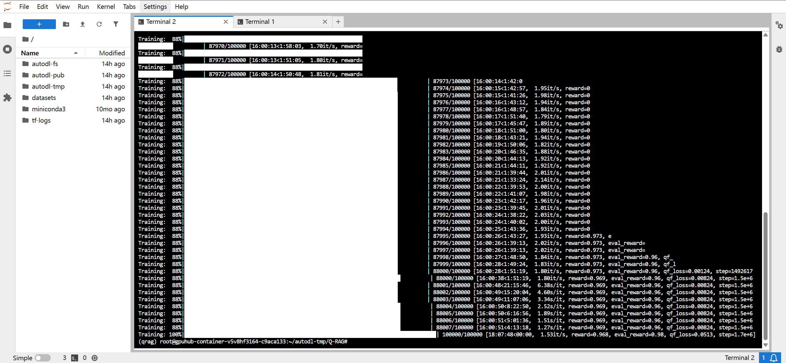
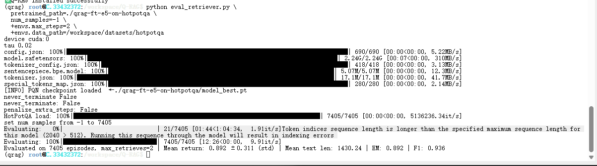
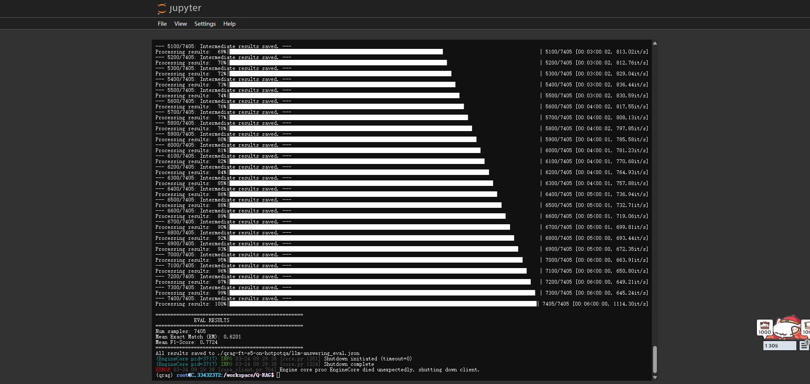
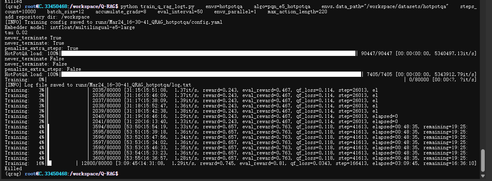
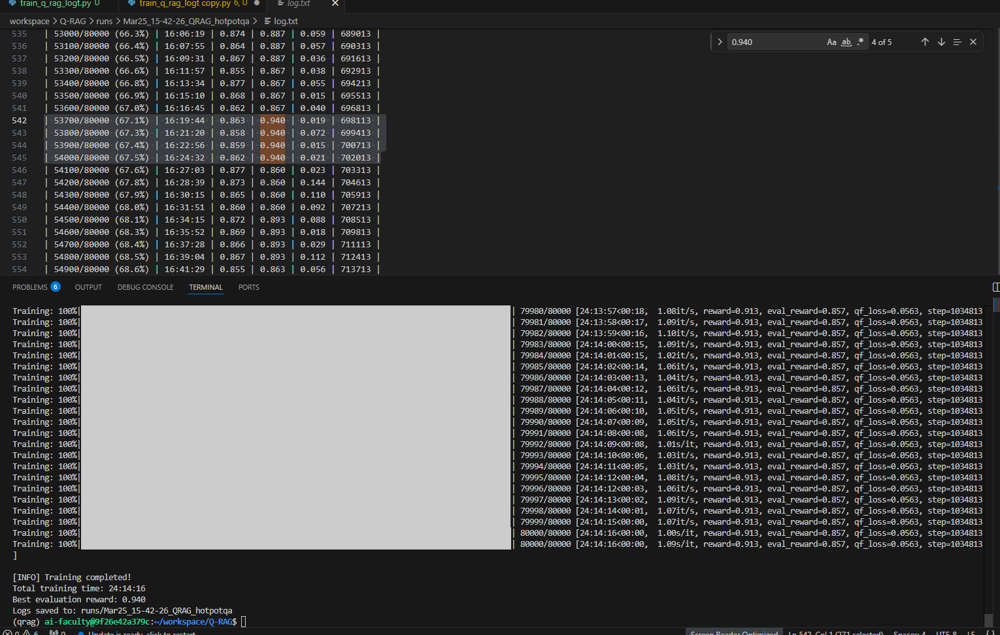
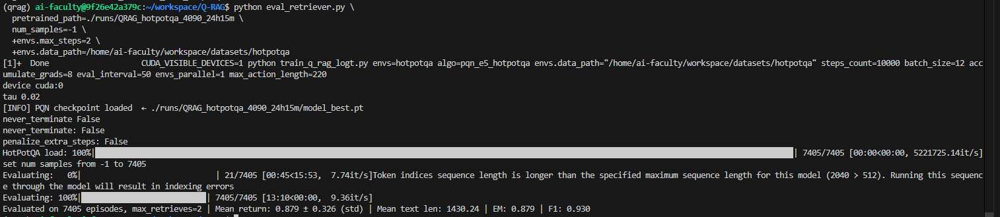
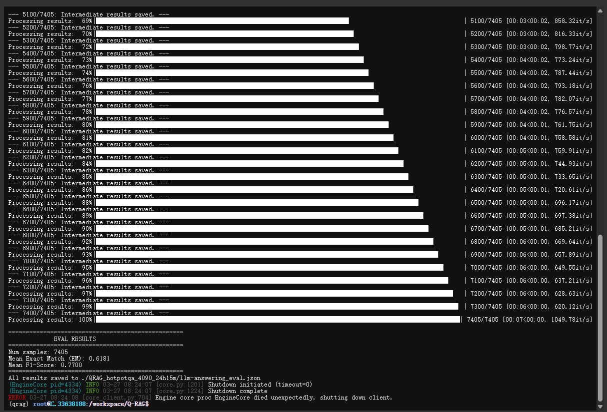

# Plan_Q-RAG
## Setup Rent GPU
```
parent_dir/
├── Q-RAG/      ← [Q-RAG](https://github.com/griver/Q-RAG.git)
└── datasets/   ← [datasets Hotpotqa and Musique](https://huggingface.co/datasets/Q-RAG/Hotpotqa_and_Musique)
```
### Git datasets for Q-RAG
```bash
git clone https://huggingface.co/datasets/Q-RAG/Hotpotqa_and_Musique
cd Hotpotqa_and_Musique
unzip hotpotqa+musique.zip -d /workspace/datasets
cd ..
rm -rf Hotpotqa_and_Musique
du -h
```
### Git repo of Q-RAG
```bash
git clone https://github.com/griver/Q-RAG.git
cd Q-RAG
#Only need when you don't have your self-trained hotpotqa model yet
git clone https://huggingface.co/Q-RAG/qrag-ft-e5-on-hotpotqa
```
### Environment Setup
```bash
# Setup venv
conda create -n qrag python=3.12 -y
conda activate qrag

python -m pip install -U pip wheel
pip install vllm  # pulls compatible PyTorch, Transformers, Triton, etc.
pip install hydra-core tensorboard rotary-embedding-torch pandas nltk sortedcontainers accelerate datasets

# Check environment
python -c "from rl.agents.pqn import PQNActor; print('✅ Q-RAG installed successfully')"

```
### Train: Log with Time
original 100
```bash
python train_q_rag_logt.py \
   envs=hotpotqa \
   algo=pqn_e5_hotpotqa \
   envs.data_path="/workspace/datasets/hotpotqa" \
   steps_count=10000 \
   batch_size=12 \
   accumulate_grads=8 \
   eval_interval=50 \
   envs_parallel=1 \
   max_action_length=220
```
Force to use GPU 1
```bash
CUDA_VISIBLE_DEVICES=1 python train_q_rag_logt.py \
   envs=hotpotqa \
   algo=pqn_e5_hotpotqa \
   envs.data_path="/home/ai-faculty/workspace/datasets/hotpotqa" \
   steps_count=10000 \
   batch_size=12 \
   accumulate_grads=8 \
   eval_interval=50 \
   envs_parallel=1 \
   max_action_length=220
```
Zip for easier download
```bash
# Server
tar -cvf - outputs_folder | pigz -6 -p 32 | split -d -b 4G - models.tar.gz.
# Client
scp <username>@<ip_address>:/your/file/location/models.tar.gz.* D:\<your\file\location>
```

E5 HotpotQA Retrievar Evaluation
```bash
python eval_retriever.py   \
   pretrained_path=./runs/QRAG_hotpotqa_4090_24h15m    \
   num_samples=-1    \
   +envs.max_steps=2    \
   +envs.data_path=/home/ai-faculty/workspace/datasets/hotpotqa
```
LLM Evaluation HotpotQA Model

```bash
python eval_llm_openqa.py \
   --file_path ./runs/QRAG_hotpotqa_4090_24h15m/eval_seed42.jsonl \
   --model_name Qwen/QwQ-32B \
   --output_file_path ./runs/QRAG_hotpotqa_4090_24h15m/llm-answering_eval.json
```

### Original Train
```bash
python train_q_rag.py \
   envs=hotpotqa \
   algo=pqn_e5_hotpotqa \
   envs.data_path="/workspace/datasets/hotpotqa" \
   steps_count=10000 \
   batch_size=12 \
   accumulate_grads=8 \
   eval_interval=100\
   envs_parallel=1 \
   max_action_length=220
```


## Computer resources
[基于HotpotQA+Musique(combined, GTE embedder) 训练出来的模型](https://huggingface.co/TroyHow/Q-RAG_Test/blob/main/QRAG_combined.zip) Q-RAG文中没有提及他的测试 <br>
- 训练时长：18:07:48
- 显卡： Pro 6000 96GB
- 显存占用：59GB ± 0.5GB


HotpotQA Retrievar Evaluation  
- 时长：00:12:26
- 显卡：NVIDIA A100-SXM4-80GB
- 显存占用：30GB ± 1GB


LLM Evaluation: Original HotpotQA Model
- 时长：1h 10m
- 显卡：NVIDIA A100-SXM4-80GB
- 显存占用：60GB ± 0.5GB


HotpotQA Training With [Log with Time](./log_50_3h.txt) As REFERENCE
  eval_interval original 100
- 训练时长：3h 10m
- 显卡： NVIDIA A100-SXM4-80GB
- 显存占用：31GB ± 0.5GB (TBC)<br>


HotpotQA Training With [4090D Log with Time](./log_50_4090_full.txt) As REFERENCE
  eval_interval 50
- 训练时长：24:14:16
- 显卡： NVIDIA 4090D 48GB
- 显存占用：31.7GB ± 0.5GB 


HotpotQA Retrievar Evaluation  
- 时长：00:12:26
- 显卡：NVIDIA A100-SXM4-80GB
- 显存占用：30GB ± 0.5GB


LLM Evaluation: 4090D HotpotQA Model (To be updated)
- 时长：1h 10m
- 显卡：NVIDIA A100-SXM4-80GB
- [显存占用](/img/LLM_Evaluation_VRAM.png)：79.6 ± 0.1GB


HotpotQA Training With [4090D Log with Time](./log_50_4090_full.txt) As REFERENCE
  eval_interval = 50 ；  batch_size = 16 ； accumulate_grads=6
- 训练时长：
- 显卡： 
- 显存占用：35.7GB


## View Log in Table Format 
[log_table.md](./log_table.md)