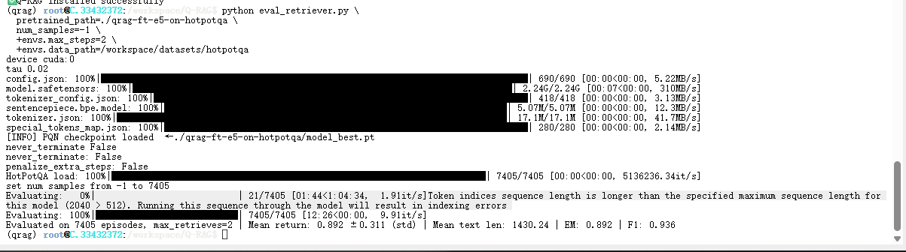
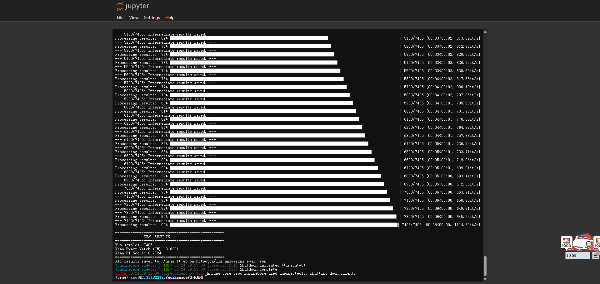
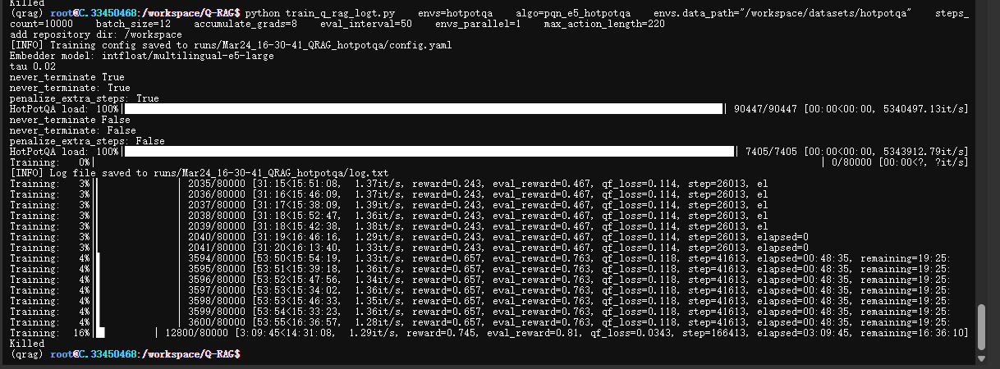
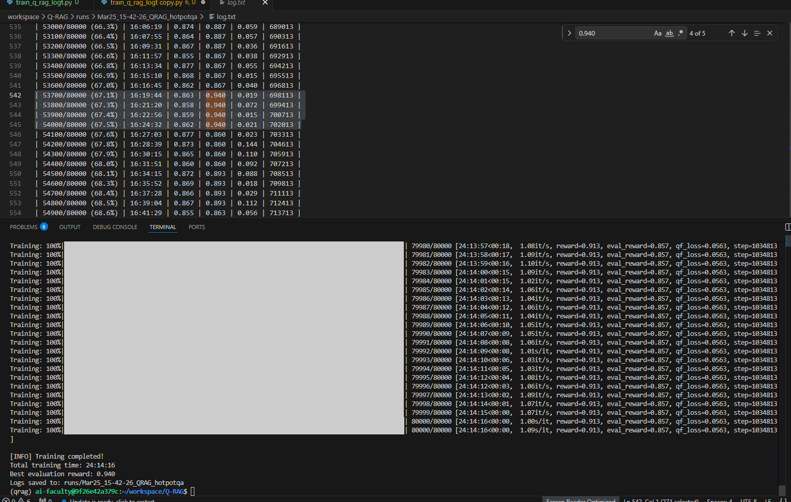
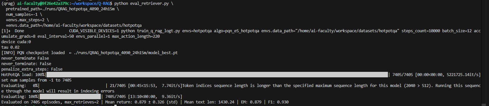
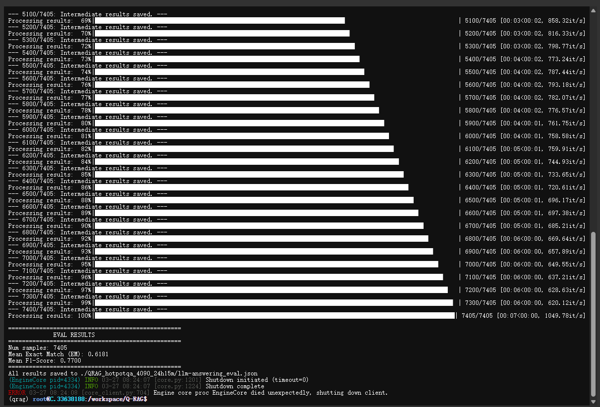
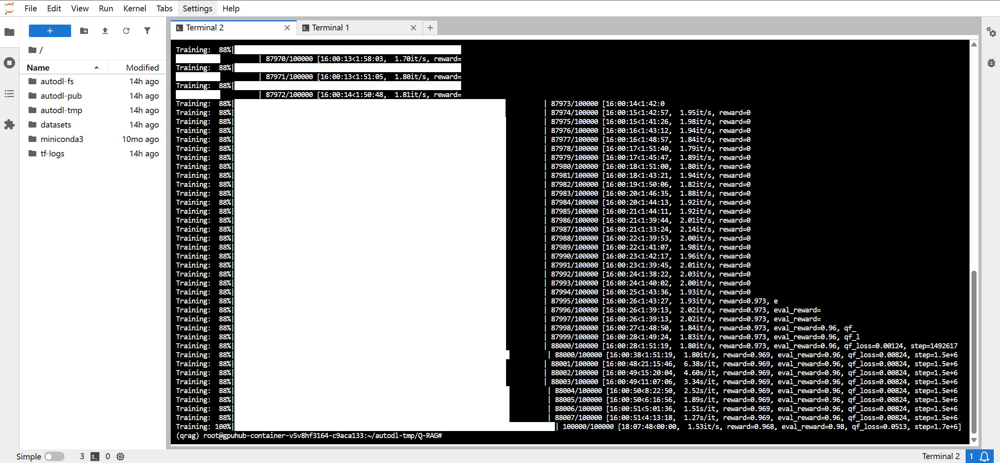

## Computer resources / Test Results
### HotpotQA Retrievar Q-RAG Original/Given Retriver
HotpotQA Retrievar Evaluation  
- 时长：00:12:26
- 显卡：NVIDIA A100-SXM4-80GB
- 显存占用：30GB ± 1GB

LLM Evaluation: Original HotpotQA Model
- 时长：1h 10m
- 显卡：NVIDIA A100-SXM4-80GB
- 显存占用：60GB ± 0.5GB

HotpotQA Training With [Log with Time](./log_50_3h.txt) As REFERENCE
  eval_interval original 100
- 训练时长：3h 10m
- 显卡： NVIDIA A100-SXM4-80GB
- 显存占用：31GB ± 0.5GB (TBC) 

### HotpotQA Retrievar Evaluation: Train on 4090D
HotpotQA Training With [4090D Log with Time](./log_50_4090_full.txt) As REFERENCE
  eval_interval 50
- 训练时长：24:14:16
- 显卡： NVIDIA 4090D 48GB
- 显存占用：31.7GB ± 0.5GB 

HotpotQA Retrievar Evaluation  
- 时长：00:12:26
- 显卡：NVIDIA 4090D 48GB
- 显存占用：30GB ± 0.5GB

LLM Evaluation: 4090D HotpotQA Model (QwQ-32B)
- 时长：1h 10m
- 显卡：NVIDIA A100-SXM4-80GB
- [显存占用](/img/LLM_Evaluation_VRAM.png)：79.6 ± 0.1GB

### HotpotQA Planner Evaluation: Train on 4090D
HotpotQA Planner Evaluation
- 时长：00:12:26
- 显卡：NVIDIA 4090D 48GB
- 显存占用：30GB ± 0.5GB

### HotpotQA+Musique Train
[基于HotpotQA+Musique(combined, GTE embedder) 训练出来的模型](https://huggingface.co/TroyHow/Q-RAG_Test/blob/main/QRAG_combined.zip) Q-RAG文中没有提及他的测试  
- 训练时长：18:07:48
- 显卡： Pro 6000 96GB
- 显存占用：59GB ± 0.5GB
